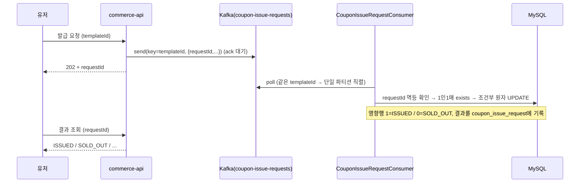

### TL;DR

DB 커밋과 Kafka 발행 사이의 원자성은 **Transactional Outbox**로 보장한다 — 이벤트를 도메인 변경과 같은 트랜잭션으로 DB(outbox 테이블)에 먼저 저장하고, 커밋된 뒤 Kafka로 보낸다. 보내는 방법은 두 가지를 겹쳤다: 커밋 직후 한 번 바로 보내 지연을 없애고, 혹시 그때 실패하면 주기적으로 도는 폴링이 결국 보내 유실을 막는다. 이벤트는 성격(유실 민감도·순서·볼륨)에 따라 전달 보장 수준을 다르게 뒀다 — 결제→주문은 유실 불허, 집계·로그는 일부 유실 허용. 선착순 쿠폰의 동시 요청은 **Kafka 파티션 직렬화 + DB 조건부 UPDATE**로 Redis 없이 초과 발급 0건을 만든다. 처리 실패 메시지는 무한 재시도 없이 DLQ로 격리하고, 어드민이 직접 트리거하는 API로만 재처리한다.

### 본문

## Introduction & Goals

- **Context / Background**
  - 비즈니스 이벤트(결제 완료, 좋아요, 상품 조회, 선착순 쿠폰 발급)가 발생하면 DB 트랜잭션 커밋과 후속 처리(집계·통지·로깅)가 이어져야 한다. 그러나 기존에는 이 후속 처리가 **본 트랜잭션에 묶여** 있어, 집계·로깅의 실패가 주문/좋아요를 롤백시키는 실패 전파가 있었다.
  - DB와 Kafka는 서로 다른 자원이라 하나의 트랜잭션으로 묶을 수 없다(dual write). 커밋 후 발행 실패 → 이벤트 유실, 발행 후 롤백 → 유령 이벤트가 생긴다.
  - 선착순 쿠폰은 순간 수천 건의 발급 요청이 몰리면 DB 락 경합이 API 서버 전체의 응답 지연으로 번진다.

- **Goals**
  1. 핵심 트랜잭션(주문 성립 조건)과 후속 처리(집계·결제 통지·로깅)를 분리한다.
  2. DB 커밋과 Kafka 발행 사이의 원자성을 확보해 **이벤트를 잃지 않는다**(At Least Once).
  3. 이벤트 특성(유실 민감도·순서 보장 필요 여부·볼륨)에 따라 전달 보장 수준을 차별화한다 — 결제→주문은 유실 불허, 집계·로그 같은 메트릭성 데이터는 **일부 유실 허용**.
  4. 선착순 쿠폰 발급 시 DB 락 없이 동시 요청을 처리하고, 초과 발급을 물리적으로 막는다.
  5. 중복 수신에도 **결과는 정확히 1회만 반영**하고, 처리 실패는 무한 재시도 없이 안전하게 격리한다.

## Detailed Design

### System Architecture

```
┌──────────────────────────────────────────────────────────────────────┐
│                            commerce-api                                │
│                                                                        │
│  [1] 비즈니스 트랜잭션                                                    │
│  PaymentService / LikeFacade / ProductFacade                          │
│       └─ applicationEventPublisher.publishEvent(...)                   │
│                                                                        │
│  [2] 커밋 직전 Outbox 저장 (결제→주문, 유실 불허)                          │
│  PaymentOutboxAppender (@TransactionalEventListener BEFORE_COMMIT)     │
│       └─ outboxRepository.save(OutboxEvent)  ── [outbox_event 테이블]    │
│                                                                        │
│  [3] 커밋 직후 곧바로 한 번 발행 시도 (실패해도 아래 [4]가 결국 발행)         │
│  OutboxImmediatePublisher (@Async + @TransactionalEventListener AFTER_COMMIT)
│       └─ kafkaTemplate.send("order-events", ...).get() → 성공 시 발행완료 표시 │
│                                                                        │
│  [4] Outbox 폴링 — [3]이 놓쳐 유예(기본 60초) 지나도 미발행인 건만            │
│  OutboxRelay (@Scheduled fixedDelay=2s)                                │
│       └─ findUnpublishedOlderThan() → send().get() → 발행완료 표시        │
│                                                                        │
│  [5] Outbox 없이 직접 @Async 발행 (집계·로그 → 일부 유실 허용)              │
│  LikeEventPublisher / ProductViewEventPublisher / ProductSoldEventPublisher
│  UserActionKafkaPublisher                                             │
│       └─ kafkaTemplate.send("catalog-events" | "user-actions", ...)    │
│                                                                        │
│  [6] 쿠폰 발급 요청 직접 발행 (202 접수, ack 대기)                         │
│  CouponIssueRequestKafkaSender                                        │
│       └─ kafkaTemplate.send("coupon-issue-requests", key=couponId, ...) │
│                                                                        │
│  소비: OrderEventsConsumer(order-events) / CouponIssueRequestConsumer(coupon-issue-requests)
└──────────────────────────────────────────────────────────────────────┘
        │                      │                     │
        ▼                      ▼                     ▼
  order-events           catalog-events        coupon-issue-requests
  (key=orderId)          (key=productId)       (key=couponTemplateId)   user-actions(key=userId)
        │                      │                                              │
        ▼                      ▼                                              ▼
┌──────────────────────────────────────────────────────────────────────┐
│                         commerce-streamer                              │
│                                                                        │
│  CatalogEventsConsumer  ← catalog-events   (group: product-metrics-consumer)
│       └─ ProductMetricsService (event_handled 멱등, product_metrics 반영) │
│                                                                        │
│  UserActionConsumer  ← user-actions        (group: user-action-collector)
│       └─ 구조적 로그 적재(멱등 불필요, append-only)                        │
└──────────────────────────────────────────────────────────────────────┘

  처리 실패(역직렬화/비즈니스 예외) → <topic>-dlq 로 격리 → 어드민 재처리 API
```

> **전달 보장을 데이터 성격으로 나눈다 — 왜 [2]와 [5]가 갈리는가.**
> `결제 → 주문`은 한 건이라도 빠지면 결제 상태와 주문 상태가 어긋나 사용자에게 보이는 값이 깨진다 → **유실 불허**라서 Outbox로 확실히 보낸다([2]).
> 반면 좋아요·조회·판매 **집계와 행동 로그는 메트릭성 데이터**다. 좋아요 수나 조회 수는 한두 건 빠져도 통계가 근사치로 충분하고, 결제·재고 같은 정합성에 영향을 주지 않는다 → **일부 유실을 허용**하고 Outbox 없이 바로 발행해 지연과 복잡도를 줄인다([5]). "무손실"을 모든 이벤트에 똑같이 걸면 비용만 커진다.

### Data Models

#### outbox_event 테이블 (결제→주문 이벤트, 유실 불허)

| 컬럼 | 설명 |
|---|---|
| `aggregate_id` | 주문 ID (파티션 키로 사용) |
| `event_type` | `PAYMENT_COMPLETED` / `PAYMENT_FAILED` |
| `payload` | 발행할 메시지 봉투(JSON) |
| `status` | `PENDING` / `PUBLISHED` / `FAILED` — `FAILED`(역직렬화 불가·발행 재시도 임계 초과)를 폴링 대상에서 빼기 위해 3상태로 둠 |
| `retry_count` | 발행 재시도 횟수(임계 초과 시 FAILED) |
| `created_at` | 생성 시각(폴링이 "만든 지 유예 시간 지난 미발행 건"을 고를 때 사용) |

인덱스 `(status, created_at, id)` — 폴링 쿼리(미발행·오래된 순)를 좁힌다.

> **`FAILED`는 유실이 아니라 회수 대상이다(유실 불허 목표와의 정합).** 릴레이는 `FAILED`로 넘기기 전에 그 이벤트를 먼저 `order-events-dlq`로 격리하므로, DLQ에 남아 어드민 재처리 API로 되살릴 수 있다.
> 단, 발행 실패의 원인이 *브로커 다운*이면 DLQ 발행(같은 브로커)도 실패한다 — 이때 `FAILED`로 굳히면 진짜 유실이므로, **DLQ 격리가 실제 성공했을 때만 `FAILED`로 종결**하고 실패하면 `PENDING`으로 남겨 브로커 복구 후 다시 격리한다. 남은 과제는 `FAILED`/DLQ 적재에 대한 **알림**(현재는 로그만) — 이건 다음 할 일이다.

#### coupon_issue_request 테이블 (선착순 발급 Inbox 겸 결과 장부)

| 컬럼 | 설명 |
|---|---|
| `request_id` | 유저의 번호표이자 **재전달 멱등 키**(unique) |
| `user_id`, `coupon_template_id` | 요청 주체·대상 |
| `outcome` | `ISSUED` / `SOLD_OUT` / `DUPLICATE` / `EXPIRED` / `NOT_FOUND`. **행은 컨슈머가 요청을 처리할 때 생성**되고, 행이 아직 없으면 조회는 `PENDING`으로 응답한다 |

같은 `request_id`가 재전달되면 이미 기록된 결과를 그대로 돌려준다(멱등). 유저는 이 테이블을 polling으로 조회한다.

#### coupon_template 테이블 (재고 카운터 겸 락)

| 컬럼 | 설명 |
|---|---|
| `total_quantity` | 발급 한정 수량 |
| `issued_quantity` | 발급된 수량 — **조건부 원자 UPDATE의 대상**(아래 Alternatives 참조) |

#### event_handled 테이블 (Consumer 멱등)

| 컬럼 | 설명 |
|---|---|
| `event_id` (PK) | 처리한 이벤트 식별자 |

멱등은 **두 단계**다: 처리 전에 `existsByEventId`로 이미 처리했는지 확인해 중복이면 건너뛰고, 처리 후 `event_handled`에 기록한다. 여기에 더해 이 엔티티를 `Persistable`로 구현해 **기록(`save`) 시 JPA가 습관적으로 하는 존재 확인 SELECT를 없애** INSERT 한 번으로 끝낸다(= 위 exists 게이트와는 별개의 저장 최적화). outbox(Producer의 "보낼 것")와 소유자·책임이 달라 별도 테이블로 둔다.

한 배치(최대 3000건) 안에서 한 건이 실패해도 배치 전체가 롤백되지 않는다 — 집계 반영이 **레코드 단위 트랜잭션**이고 컨슈머가 레코드마다 `try/catch`로 감싸므로, 실패는 그 한 건만 DLQ로 격리되고 배치는 계속된다.

#### 전체 토픽 목록

| 토픽 | 파티션 키 | 파티션 | Consumer(그룹) |
|---|---|---|---|
| `catalog-events` | productId | 3 | CatalogEventsConsumer (product-metrics-consumer) |
| `order-events` | orderId | 3 | OrderEventsConsumer (order-payment-consumer) |
| `coupon-issue-requests` | couponTemplateId | 3 | CouponIssueRequestConsumer (coupon-issue-consumer) |
| `user-actions` | userId | 3 | UserActionConsumer (user-action-collector) |
| `*-dlq` | 원본 key | 1 | (어드민 온디맨드 재처리) |

파티션 수는 브로커 auto-create 디폴트에 맡기지 않고 `KafkaTopicConfig`의 `NewTopic`으로 고정한다.

### Message Design

타입 헤더를 끈 상태(`spring.json.add.type.headers=false`)라 payload 안에 종류를 담고, Consumer는 `ByteArrayDeserializer`로 받아 `ObjectMapper`로 역직렬화한다.

#### catalog-events (좋아요 수 변경 / 상품 조회 / 판매)

`CatalogEventPayload(eventId, eventType, productId, userId, occurredAt, quantity, likeCount)` — 종류별로 채우는 필드가 다르다.

| eventType | 채우는 필드 | 멱등 전략 |
|---|---|---|
| `PRODUCT_LIKE_COUNT_CHANGED` | likeCount(스냅샷) | 스냅샷 latest-wins (occurredAt 비교) |
| `PRODUCT_VIEWED` | (없음) | 무멱등(근사 집계) |
| `PRODUCT_SOLD` | quantity | `event_handled`(eventId=`sold-{orderItemId}`) |

> **판매(PRODUCT_SOLD)는 왜 "일부 유실 허용"인데 중복은 막나.** `sales_count`는 인기·랭킹 표시용 집계다. 한 건 누락은 근사치에 묻히지만, *중복 반영은 랭킹을 눈에 띄게 부풀린다*. 그래서 이 지표에선 완전성(유실 방지)보다 **중복 방지**의 이득이 커서, 유실은 허용하되 `event_handled`로 중복만 막는 비대칭이 합리적이다. (좋아요·조회는 중복의 영향도 작아 멱등을 더 가볍게 둔다.)

#### order-events (결제 확정)

`OrderEventMessage(OrderEventType eventType, Long orderId)` — `PAYMENT_COMPLETED` / `PAYMENT_FAILED`. `OrderEventsConsumer`가 이 이벤트를 받아 **주문 상태를 전이**한다 — `PAYMENT_COMPLETED`면 주문을 `PAID`로, `PAYMENT_FAILED`면 실패 처리. 이미 전이된 주문이면 상태 가드(`status != CREATED`)로 무시하므로 중복 전달에도 안전하다. (결제 트랜잭션에서 상태 전이를 떼어내 이벤트로 처리 → PG 지연이 결제 확정을 막지 않는다.)

#### coupon-issue-requests (선착순 발급 요청)

`CouponIssueMessage(requestId, userId, couponTemplateId)` — `requestId`가 멱등 키. `key=couponTemplateId`로 같은 쿠폰 요청을 한 파티션에 모아 순차 처리한다.

#### user-actions (유저 행동 로그)

`UserActionMessage(userId, action, targetId, occurredAt)` — 로그성 데이터라 일부 유실/중복에 관대(멱등 테이블 불필요).

### API Design

#### 선착순 발급 요청 — 접수만 하고 202

`POST /api/v1/coupons/{templateId}/issue-requests` → `requestId` 반환(202). 실제 발급은 컨슈머가 비동기 순차 처리.

#### 발급 결과 조회 (폴링)

`GET /api/v1/coupons/issue-requests/{requestId}` → `PENDING / ISSUED / SOLD_OUT / DUPLICATE / EXPIRED / NOT_FOUND`.

> **한계 — `PENDING`과 "없는 requestId"를 구분하지 못한다.** 결과 행은 API 접수(202)가 아니라 *컨슈머가 처리할 때* 생성된다. 그래서 아직 처리 안 된 정상 요청과 존재하지 않는 엉터리 `requestId`가 모두 "행 없음 → `PENDING`"으로 보인다. `requestId`는 서버가 202로 발급하는 값이라 위조가 아니면 잘 안 생기는 저심각도 문제지만, 엄밀히 나누려면 202 시점에 `PENDING` 행을 미리 만들어야 한다. (`NOT_FOUND` outcome은 의미가 다르다 — 처리했더니 *templateId가 없더라*는 결과다.)

#### DLQ 재처리 (어드민)

`POST /api-admin/v1/dlq/replay?topic={topic}` (헤더 `X-Loopers-Ldap` 필요) → `-dlq`에 격리된 메시지를 원본 토픽으로 되돌린다. 토픽 화이트리스트로 임의 재발행을 차단한다.

#### 선착순 발급 시퀀스



### Constraints

- **단일 브로커(KRaft)** — `replication-factor=1`. 브로커 내부 유실 구간은 outbox로 못 막는다(운영은 3 + `min.insync.replicas=2`).
- **릴레이 단일 인스턴스 전제** — 다중 인스턴스에선 중복 발행 가능(소비 멱등으로 흡수, 분산락 미도입).
- **인기 쿠폰 한 건의 처리량 한계** — 같은 쿠폰 요청은 한 파티션에서 순서대로, 같은 DB 행 하나를 갱신하므로 파티션을 늘려도 그 쿠폰의 처리 속도는 못 올린다.
- **client `auto.create.topics.enable=false`는 브로커 자동생성을 막지 못했다** — 실제로는 디폴트 1파티션으로 생성됐고, `NewTopic`으로 파티션을 고정해 해결.

## Alternatives Considered

### [이벤트 처리 경로] 즉시 발행 vs 폴링 vs 하이브리드

| 대안 | 설명 | 트레이드오프 |
|---|---|---|
| A. 커밋 직후 바로 발행만 | 지연 없음 | 그 순간 프로세스가 죽으면 이벤트가 사라짐 |
| B. 폴링으로만 발행 | 이벤트를 잃지 않음 | 폴링 주기만큼 항상 발행이 늦음(초 단위) |
| **선택: C. 둘을 겹침** | 커밋 직후 바로 한 번 보내 지연을 없애고, 실패하면 폴링이 뒤에서 메꾼다 | 폴링은 매번 발행하는 주 수단이 아니라 **놓친 것만 메꾸는 보완 수단**이라, 정상 건은 바로 나가고 폴링 부하도 낮다. 다만 직후 발행이 실패한 건은 유예 시간만큼 복구가 늦는다 |

**선택 근거:** 폴링만 믿으면 정상 흐름에도 지연이 붙고, 커밋 직후 발행만 믿으면 그 순간 장애 시 유실이 남는다. 커밋과 outbox 기록을 한 트랜잭션으로 묶어 "이벤트를 반드시 남기는 것"부터 보장한 뒤, 발행 속도(직후 발행)와 확실성(폴링)을 둘 다 챙긴다.

**유예(grace) 값 — 왜 60초인가.** 폴링이 "만든 지 유예 시간 지난 건"만 줍는 이유는 딱 하나, *아직 진행 중인 직후 발행과 겹쳐 이중 발행하는 것*을 피하려는 것이다. 직후 발행 타임아웃이 5초이므로 유예는 그보다 넉넉하면 충분하다. 이 값을 크게(예: 10분) 잡으면 **직후 발행이 실패한 정상 케이스도 그만큼 방치**돼, 유실 불허 경로에 불필요한 정합성 지연 구간이 생긴다. 그래서 "경합 회피"에 필요한 최소선인 **60초**로 둔다(복구 지연은 짧을수록 좋다).

### [쿠폰 발급 동시성] 재고 차감 전략

| 대안 | 설명 | 트레이드오프 |
|---|---|---|
| A. DB 비관 락(`FOR UPDATE`) | 정확하지만 | 스파이크에 락 대기가 API 전체로 전파 |
| B. 낙관 락(`@Version`) | 락 대기 없음 | 충돌 많은 선착순에서 재시도 폭풍 |
| C. Kafka 큐잉 + **Redis** DECR | 컨슈머 직렬 + 원자 카운터 | 인프라(Redis) 추가 |
| **선택: D. Kafka 직렬화 + DB 조건부 UPDATE** | `key=couponTemplateId`로 같은 쿠폰을 한 파티션에서 순서대로 처리 + `update ... set issued_quantity=issued_quantity+1 where issued_quantity < total_quantity` (갱신된 행 수 1=성공, 0=소진) | Redis 없이 정합성 확보. 인기 쿠폰 한 건의 처리 속도는 못 올림 |

**선택 근거:** Kafka 파티션이 같은 쿠폰 요청을 직렬화하므로 DB 수준의 동시성 처리가 크게 줄고, 남은 경합은 조건부 UPDATE 한 줄이 원자적으로 처리한다. 별도 인프라(Redis) 없이 초과 발급을 구조적으로 0건으로 만든다. 1인1매는 `issued_coupon` exists 체크로 방어한다.

### [DLQ 재처리] 자동 재시도 vs 수동(어드민)

| 대안 | 트레이드오프 |
|---|---|
| A. `-dlq` 리스너가 자동으로 원본 토픽에 재주입 | 영원히 실패하는 메시지가 실패→DLQ→재주입을 반복하는 **무한 루프** 위험 |
| **선택: B. 어드민이 직접 트리거하는 API** | 사람이 원인 확인 후 실행 → 무한 루프 없음. 대신 사람의 개입 필요 |

### **Kafka Setting**

#### `modules/kafka/src/main/resources/kafka.yml`

| 설정 | 값 | 이유 |
|---|---|---|
| `spring.json.add.type.headers` | `false` | 멀티모듈이 클래스 경로를 공유하지 않아, 타입 헤더를 켜면 역직렬화 실패. payload에 종류를 담는다 |
| `request.timeout.ms` | `20000` | 일시적으로 느린 브로커에서 즉시 실패하지 않도록 버퍼 |
| `retry.backoff.ms` | `500` | 요청 실패 후 재시도 대기 |
| `auto.offset.reset` | `latest` | 오프셋 없을 때 과거 전체 재처리 방지 |
| `producer.acks` | `all` | 모든 ISR 적재 후 ack. **단, 현재 단일 브로커(RF=1)에선 ISR이 리더 하나뿐이라 `acks=1`과 동일** — 내구성 효과는 운영 RF≥3부터 나온다. 지금은 아래 `enable.idempotence=true`의 전제 조건으로만 기능한다 |
| `producer.retries` | `3` | 일시적 네트워크 오류 재시도 |
| `producer.enable.idempotence` | `true` | 재시도로 인한 중복 발행 방지(`acks=all`·`retries`가 전제) |
| `value-serializer` / `value-deserializer` | `JsonSerializer` / `ByteArrayDeserializer` | 발행은 객체→JSON, 소비는 byte[]로 받아 직접 역직렬화 |
| `consumer.enable-auto-commit` | `false` | 처리 실패 시 재처리 가능하도록 수동 커밋 |
| `listener.ack-mode` | `manual` | 비즈니스 로직 완료 후 명시적 커밋(at-least-once) |

#### `KafkaConfig` — BATCH_LISTENER 컨테이너 팩토리

| 설정 | 값 | 이유 |
|---|---|---|
| `MAX_POLL_RECORDS` | 3000 | 배치 처리로 DB 왕복 감소 |
| `FETCH_MIN_BYTES` | 1MB | 드문 트래픽에서 네트워크 왕복 감소 |
| `FETCH_MAX_WAIT_MS` | 5s | 1MB 미충족 시 최대 대기(실시간성) |
| `SESSION_TIMEOUT_MS` | 60s | 오탐 리밸런싱 방지 |
| `HEARTBEAT_INTERVAL_MS` | 20s | SESSION_TIMEOUT의 1/3(권장값) |
| `MAX_POLL_INTERVAL_MS` | 120s | 배치 처리 시간 확보 |
| `concurrency` | 3 | 파티션 수(3)와 일치 |
| `AckMode` | MANUAL | 로직 완료 후 명시적 커밋 |

## Cross-cutting Concerns

- **실패 격리(DLQ)**: 배치 리스너라 프레임워크가 실패 레코드만 자동으로 골라주지 않는다 — **컨슈머가 레코드마다 `try/catch`로 감싸** 실패한 그 한 건만 `<topic>-dlq`로 보내고, 배치는 끝까지 처리한 뒤 한 번 커밋(ack)한다. 그래서 poison 한 건이 파티션을 막지 않는다. DLQ 발행 자체가 실패해도 예외를 밖으로 던지지 않는다.
- **@Async 안전장치**: 발행 실행기는 풀·큐를 바운드하고(무한 적재 방지), 배포 시 `spring.task.execution.shutdown.await-termination`으로 진행 중 발행을 기다린다.
- **스케줄러 격리**: `@Scheduled`가 단일 스레드면 느린 릴레이가 결제 복구 스케줄러를 막으므로 `spring.task.scheduling.pool.size`로 분리.
- **민감정보**: 외부로 나가는 봉투는 내부 이벤트 객체를 그대로 직렬화하지 않고 명시 조립(내부 모델 ≠ 외부 계약). 유저 식별자 로그는 DEBUG로 강등.

## Reference

- 설계 의사결정 상세: `.docs/design/round7/design-decisions.md`
- 전체 플로우 도식: `.docs/round7/round7-full-flow.md`
